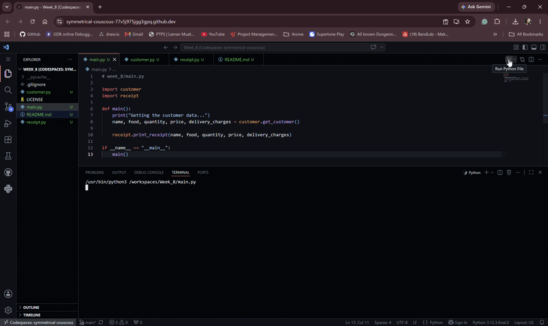

# Week 8 Food Delivery System Backend Receipt Generator

## Purpose of the Application
The purpose is to automate:
1. Subtotal Calculation
2. Service Charge (5%)
3. Delivery Charge
4. Grand Total
5. Display I0nformation in a Receipt Format

## Tech Stack
- Language: Python 3
- Modules: Native custom modules (`customer.py`, `receipt.py`)
- Key Concepts: Python `import`, functions with return values, conditional statements (if-else), input handling, type conversion, output formatting with f-strings.

## How to use
To run this application, ensure all three Python files (`main.py`, `customer.py`, and `receipt.py`) are in the same folder.

1. Open your terminal or command prompt.
2. Navigate to the directory containing the files.
3. Run the following command: python main.py

## Demo

